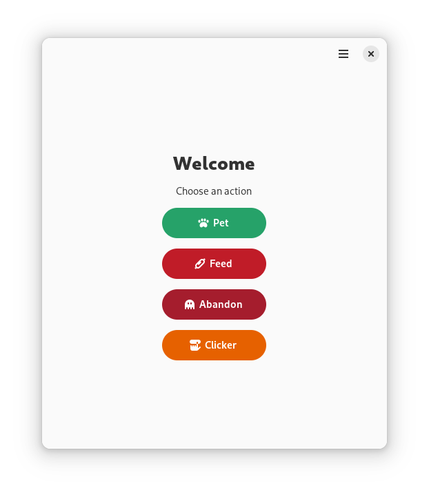
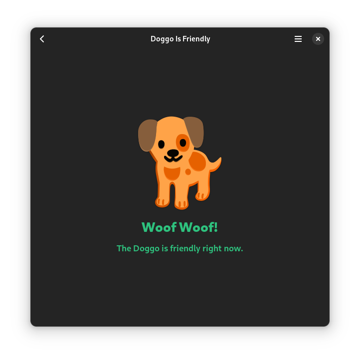
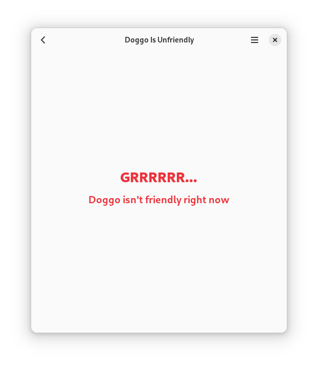

<!-- Definitions -->
[flathub]: https://flathub.org/apps/app.drey.Doggo
<!-- End Defenitions -->

> <span class="attention-icon attention-warning"><svg viewBox="0 0 16 16" class="svg octicon-alert" aria-hidden="true" width="16" height="16"><path d="M6.457 1.047c.659-1.234 2.427-1.234 3.086 0l6.082 11.378A1.75 1.75 0 0 1 14.082 15H1.918a1.75 1.75 0 0 1-1.543-2.575Zm1.763.707a.25.25 0 0 0-.44 0L1.698 13.132a.25.25 0 0 0 .22.368h12.164a.25.25 0 0 0 .22-.368Zm.53 3.996v2.5a.75.75 0 0 1-1.5 0v-2.5a.75.75 0 0 1 1.5 0ZM9 11a1 1 0 1 1-2 0 1 1 0 0 1 2 0Z"></path></svg> **Important**<br/></span>
> <span class="attention-icon attention-warning">**Doggo has [moved to GNOME GitLab](https://gitlab.gnome.org/sungsphinx/Doggo)**</span>

[][flathub]
[][flathub]
[](https://stopthemingmy.app)
[](https://nogithub.codeberg.page)
[](https://codeberg.org/SOrg/DogQt/src/branch/main/LICENSE)
[](#install)
<!-- [](https://ci.codeberg.org/repos/12896) -->


# Doggo
Clicker &amp; chance game</br>[Silly Org Website](https://sorg.codeberg.page) · [Submit Bug Report or Feature Request](https://codeberg.org/SOrg/Doggo/issues/new/choose) · [Install](#install) · [Credits](#credits) · [Funny Dog (Bruno)](https://codeberg.org/SOrg/Doggo/raw/branch/main/data/ui/images/bjrunoada.jpg)
</div>

## Screenshots
 |  | 
-------------------------------------------- | -------------------------------------- | ----------------------------------------------

## Clone Repo?
1. Make sure git is installed.
2. Run ```git clone https://codeberg.org/SOrg/Doggo.git``` in the directory you want to clone this repo to.

## Install

### Install (Stable Version via Flathub)

[][flathub]

### Install (Development Version)

**1.** Install Flatpak (if it isn't installed already, **with [Flathub](https://flathub.org) and the [GNOME Nightly remote](https://wiki.gnome.org/Apps/Nightly)**) and flatpak-builder.

**2.** Make sure you have ```runtime/org.gnome.Platform/[x86_64/aarch64]/master``` &amp; ```runtime/org.gnome.Sdk/[x86_64/aarch64]/master``` installed, you can install the platform with:

```
flatpak install runtime/org.gnome.Platform/[x86_64/aarch64]/master
```

And the SDK with:

```
flatpak install runtime/org.gnome.Platform/[x86_64/aarch64]/master
```
### (Choose x86_64 for 64/32bit, aarch64 for arm64)

**3.** Download the [Flatpak Manifest](build-aux/flatpak/app.drey.Doggo.Devel.json) and make a folder to put it in.

**4.** Open a terminal in that folder and choose one of the following to run:

* **4a.** Install Directly: 
```
flatpak-builder --install --force-clean build-dir app.drey.Doggo.Devel.json
```

* **4b.** Build Bundle: 

```
flatpak-builder --repo=repo --force-clean build-dir app.drey.Doggo.Devel.json
```

Then run:

```
flatpak build-bundle repo app.drey.Doggo.Devel.flatpak app.drey.Doggo.Devel
``` 
This will create a bundle (*.flatpak). Read more about single-file bundles [here](https://docs.flatpak.org/en/latest/single-file-bundles.html).

## Credits
[Bilal Elmoussaoui](https://belmoussaoui.com) - [Icon Library app](https://flathub.org/apps/org.gnome.design.IconLibrary) (used for the app icon, modified obviously to be an actual app icon)\
[Maximiliano Sandoval](https://gitlab.gnome.org/msandova) - [Emblem app](https://flathub.org/apps/org.gnome.design.Emblem) (used for background gradient of repo avatar/icon)\
[Libadwaita Demo](https://gitlab.gnome.org/GNOME/libadwaita/-/blob/main/demo) - [Debug Information/Troubleshooting for about window](https://gitlab.gnome.org/GNOME/libadwaita/-/blob/main/demo/adw-demo-debug-info.c)
