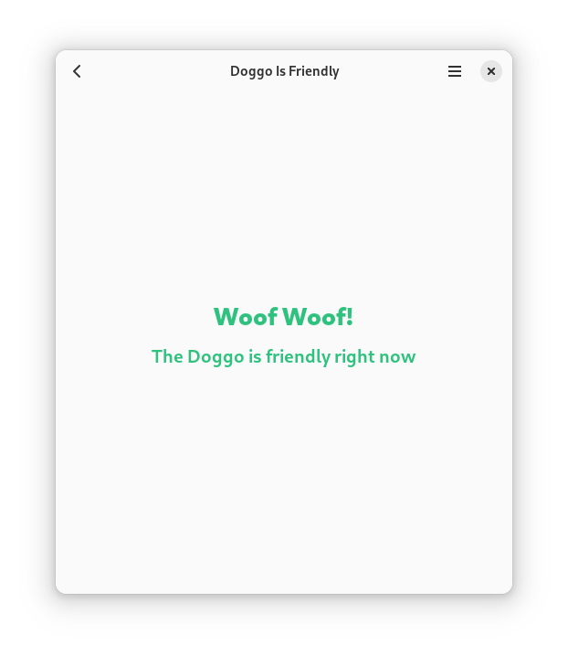

<!-- Definitions -->
[flathub]: https://flathub.org/apps/page.codeberg.SOrg.DogGTK
<!-- End Defenitions -->
<!--
> **Warning*
> <br/>**Doggo as of now is in maintenance mode.**
-->
[][flathub]
[][flathub]
[](https://stopthemingmy.app)
[](https://nogithub.codeberg.page)
[](https://codeberg.org/SOrg/DogQt/src/branch/main/LICENSE)
[](#install)


# Doggo
GTK4 + Libadwaita Actions &amp; AdwNavigationView demo, also kind of a game.</br>[Silly Org Website](https://sorg.codeberg.page) · [Issue Tracker](https://codeberg.org/SOrg/Doggo/issues) · [Install](#install) · [Credits](#credits) · [Funny Dog (Bruno)](https://codeberg.org/SOrg/Doggo/raw/branch/main/data/ui/images/bjrunoada.jpg)
</div>

## Screenshots
 |  | 
-------------------------------------------- | -------------------------------------- | ----------------------------------------------

## Clone Repo?
1. Make sure git is installed.
2. Run ```git clone https://codeberg.org/SOrg/Doggo.git``` in the directory you want to clone this repo to.

## Install

> #### **Warning**
> Flatpak is the **only officially supported** way of distributing this app, **any issues by people which use a non-flatpak version will be closed.**

### Install (Stable Version via Flathub)

[](https://flathub.org/apps/page.codeberg.SOrg.DogGTK)

### Install (Development Version)

**1.** Install Flatpak (if it isn't installed already, **with [Flathub](https://flathub.org) and the [GNOME Nightly remote](https://wiki.gnome.org/Apps/Nightly)**) and flatpak-builder.

**2.** Make sure you have ```runtime/org.gnome.Platform/x86_64/master``` &amp; ```runtime/org.gnome.Sdk/x86_64/master``` installed, you can install the platform with:

```
flatpak install runtime/org.gnome.Platform/x86_64/master
```

And the SDK with:

```
flatpak install runtime/org.gnome.Platform/x86_64/master
```


**3.** Download the [Flatpak Manifest](build-aux/flatpak/page.codeberg.SOrg.DogGTK.Devel.json) and make a folder to put it in.
* Where is the original manifest? [[Jump]](#original-manifest-non-devel)

**4.** Open a terminal in that folder and choose one of the following to run:

* **4a.** Install Directly: 
```
flatpak-builder --install --force-clean build-dir page.codeberg.SOrg.DogGTK.Devel.json
```

* **4b.** Build Bundle: 

```
flatpak-builder --repo=repo --force-clean build-dir page.codeberg.SOrg.DogGTK.Devel.json
```

Then run:

```
flatpak build-bundle repo page.codeberg.SOrg.DogGTK.Devel.flatpak page.codeberg.SOrg.DogGTK.Devel
``` 
This will create a bundle (*.flatpak). Read more about single-file bundles [here](https://docs.flatpak.org/en/latest/single-file-bundles.html).

## Credits
[Google](https://about.google) - [Noto (& Color) Emoji](https://github.com/googlefonts/noto-emoji)\
[Bilal Elmoussaoui](https://belmoussaoui.com) - [Icon Library app](https://flathub.org/apps/org.gnome.design.IconLibrary) (used for repo avatar/icon)\
[Maximiliano Sandoval](https://gitlab.gnome.org/msandova) - [Emblem app](https://flathub.org/apps/org.gnome.design.Emblem) (used for background gradient of repo avatar/icon)\
[Libadwaita Demo](https://gitlab.gnome.org/GNOME/libadwaita/-/blob/main/demo) - [Debug Information/Troubleshooting for about window](https://gitlab.gnome.org/GNOME/libadwaita/-/blob/main/demo/adw-demo-debug-info.c)
